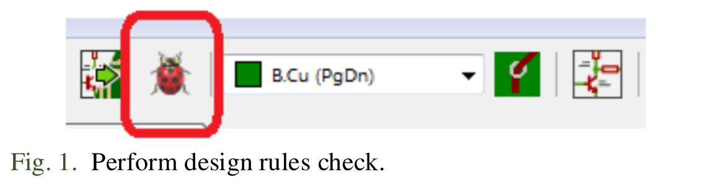
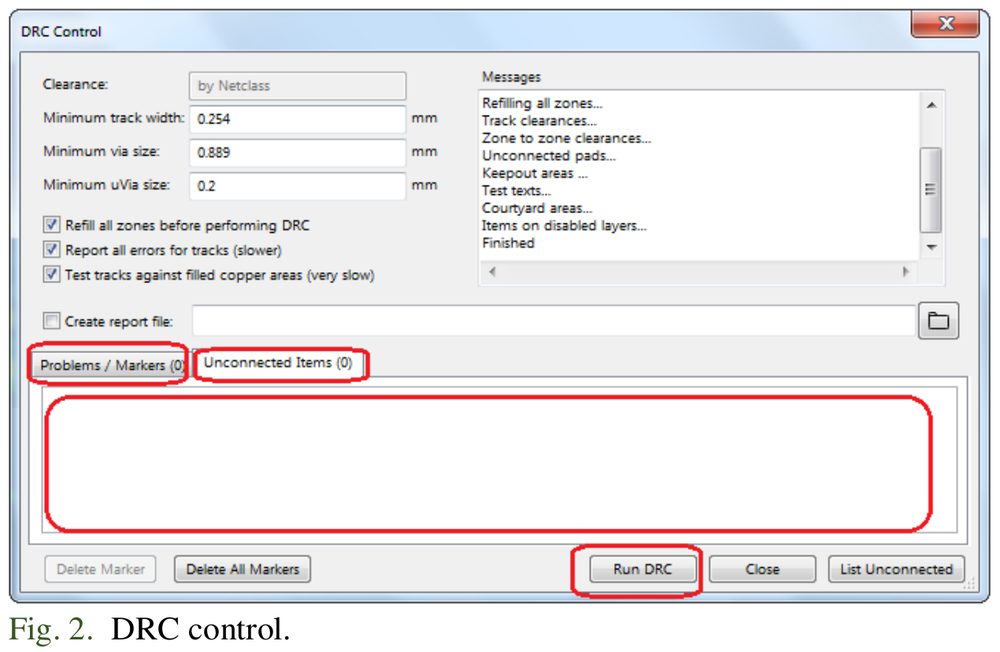
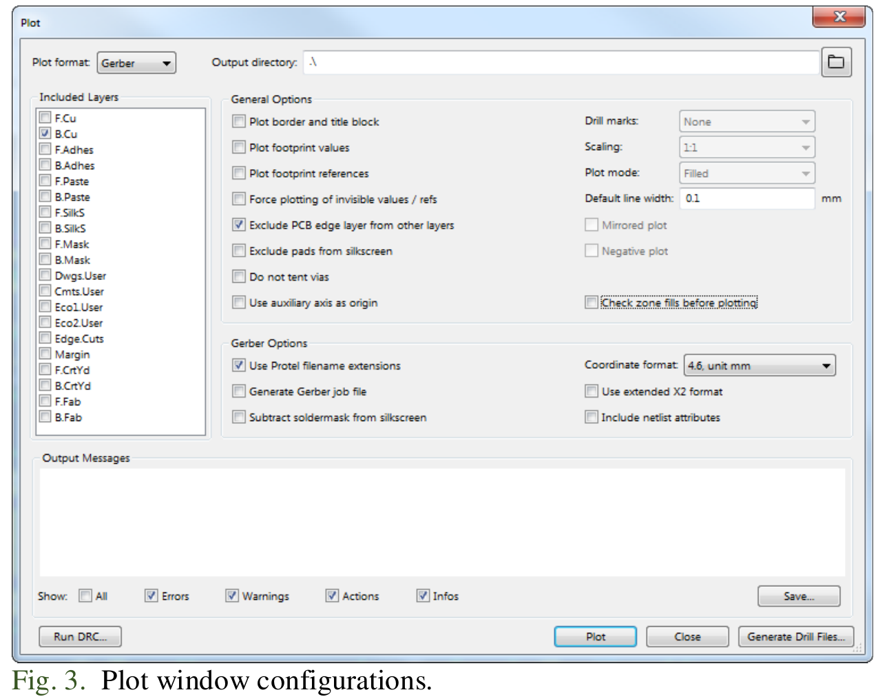
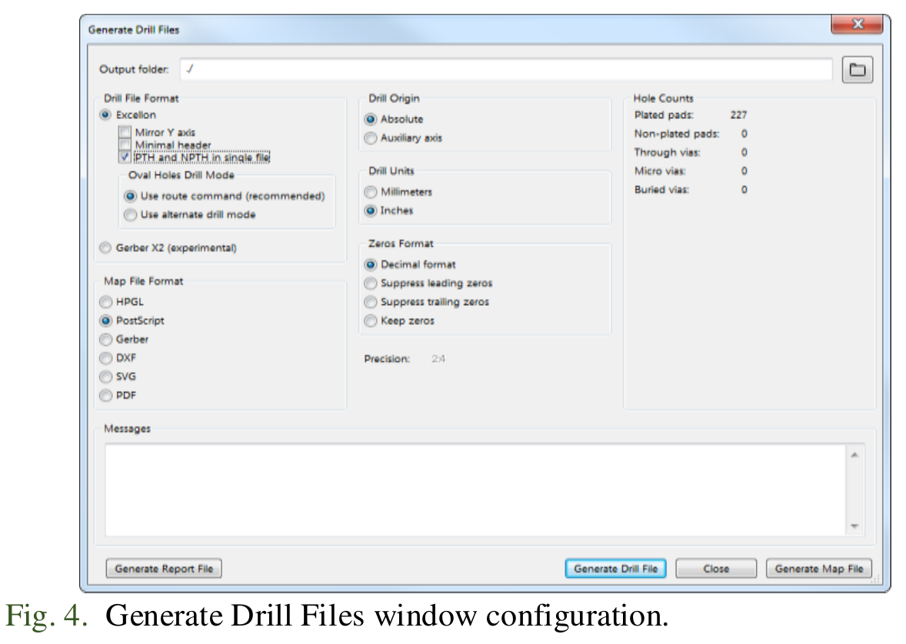

# Practica3ArturoBuganza
This is the third practice form the microcontoller laboratory

## Objectives

Build the minimum system from the designs that thei student made on the practices 1 and 2.

## Introduction

Microcontrollers are all around  he world. Each day, Microcontrollers, are more present in the many aspects of our lives: in our work, inside our houses, and in more. We can find them controlling small devices like cellphones, microwaves, washing machines, and televisions.

A microcontroller is one device or chip that is used to govern one or more processes. For example, the controller that regulates the room temperature of an air conditioner; it has a sensor that continuously measures the internal temperature and, when the preset limits are exceeded, it generates the necessary signals to adjust the temperature.

## State of the Art

### The practices and the PIC microcontroller

The main objective of this practices is to provide students the foundation to fully understand the operation of the PIC18F45K50 microcontroller. This will be achieved through 11 documents that will guide the reader to create their own electronic card or Printed Circuit Board (PCB) and to be able to program it; in order to, execute different functions.

The advantages of ta PIC microcontroller to others on the market, which is why it will be used throughout this manual, are as follows:

- Easy to operate.
- There is enough documentation to work with it and it’s easy to obtain it.
- The price is comparatively lower than its competitors.
- It has a high operating speed.
- Development tools are cheap and easy to use.
- There are a variety of hardware that can record, erase and check the behavior of PIC.
- Once you learn to handle a PIC, it will easier to handle any other models of microcontrollers.

### KiCad EDA Software

KiCad is an open source software suite for Electronic Design Automation (EDA). The programs handle Schematic Capture,
and PCB Layout with Gerber output. The suite runs on Windows, Linux and macOS and is licensed under GNU GPL v3. The
first release date was in 1992 by its original author, Jean-Pierre Charras, but is now currently under development by
the KiCad Developers Team. 

## Results

This practice is pretty fast, but it makes us look at the final product as a simulation, in order for we to obtain this we needed to export the files to make them ready to be printed or hand crafted into the silicon plate. The results were satisfiying, the screenshots are forward ahead in the Demonstration section.

### Follow the next 'Project Configuration' Steps

1. Now that your PCB is completed, you can generate the Gerber files for each layer of your board. Click on Perform design rules check as shown in Fig. 1. Then click on the Run DCR, if everything goes right you will get no message of error, as show in figure 2.

2. Click on File→Plot... Select ‘Gerber’ as ‘Plot Format,’also you must choose a folder to save your generated files. Make sure that only the next options are selected: B.Cu from ‘Layers’ box, Exclude PCB edge layer from other layers from ‘Options’ box, and Use proper filename extensions from ‘Gerber Options’ box; as shown in Fig. 3.

3. Finally, click on ‘Plot’ and then click on Generate Drill File. A new window will appear with some options on default. In the section Excellon Drill File Options select the ‘PTH and NPTH holes in single file’ box, then click on the button ‘Generate Drill File.’ Next, in the section Drill Map File Format change to ‘PDF’ box and click on ‘Generate Drill File’ again, see Fig. 4.

4. Once the Gerber and Drill files are generated, you can check your track design [here](https://www.pcbgogo.com/GerberViewer.html). Use the file with the .gbl and .drl extension.

### Report
For this practice, modify only the Conclusion section. Commit an push the changes on the fork of this repository and add
upload the link on Canvas.

### File uploads
Commit and push the files with extensions .pro, .gbl, and .drl  created once you completed all the steps of the document in the repository.

### Demonstration
Screenshot drill.

Screenshot gerber.

## Conclusion

This third practice was significantly faster than the last two. This last step allows us to look at the holes needed to drill, and the cupper pats that need to be added in the piece in order for it to work properly.

The gerber view allows us to see the paths and conections, while the drill view helps us with the holes proyection. Combining these two we get a good idea of the possible final product.

The hardest part here was to follow the steps correctly, but it wasnt that hard since it is described in the practice click by click.
